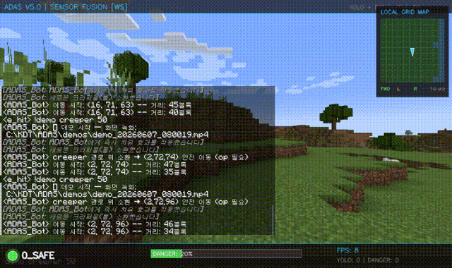
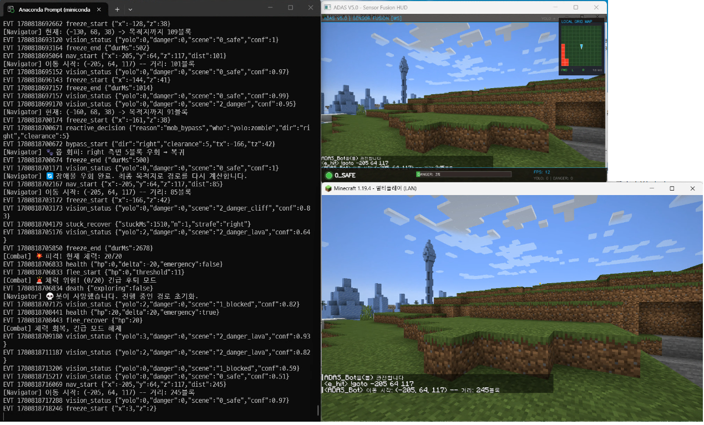
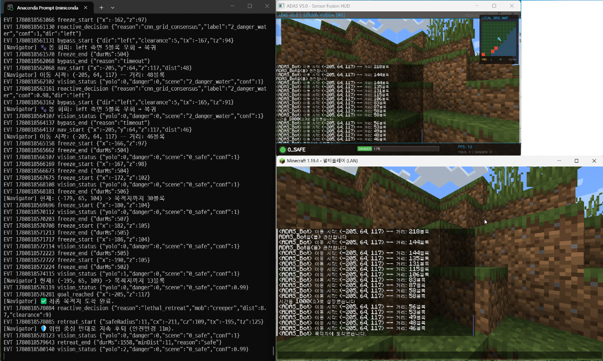
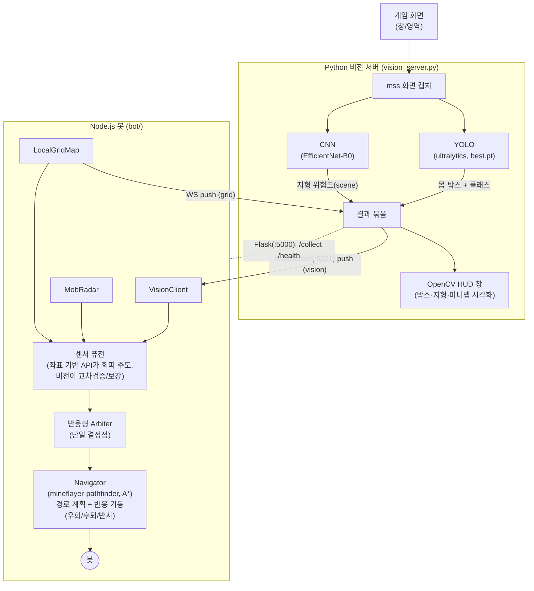

# Minecraft ADAS — 마인크래프트 자율주행(ADAS) 봇

> **Mineflayer 기반 자율주행 에이전트.** 컴퓨터 비전(YOLO 몹 탐지 + CNN 지형 분류)과
> 게임 API 센서(엔티티/블록 스캔)를 **센서 퓨전**하여, 위험 몹을 회피하며 목표 좌표까지
> 자율 주행한다. 실제 차량 ADAS(첨단 운전자 보조 시스템)의 *인지 → 판단 → 제어* 파이프라인을
> 마인크래프트 환경에 옮긴 프로젝트.

---


## 데모

<p align="center">
  
</p>

<table>
  <tr>
    <td align="center"><br>출발</td>
    <td align="center"><br>도착</td>
  </tr>
</table>

봇은 인게임 1인칭 시점 뷰어(`http://localhost:3007`)로 주행을 관전할 수 있고,
비전 서버의 OpenCV HUD 창에서 YOLO/CNN 인지 결과를 실시간으로 확인할 수 있다.

프로젝트의 설계 배경과 전체 구조는 [프로젝트 문서](docs/ADAS_Minecraft.pdf)에 정리되어 있다.

---

## 개요

마인크래프트에서 봇이 **지정한 좌표까지 안전하게 이동**하는 것을 목표로 한다.
이동 중 적대적 몹(크리퍼·좀비·스켈레톤 등)과 위험 지형(용암·물·절벽)을 인지하고 회피한다.

설계의 핵심은 **이종 센서의 역할 분리와 퓨전**이다.

- **컴퓨터 비전(주 인지 센서, Python):** 게임 화면을 캡처해 YOLO로 몹을 탐지하고,
  CNN(EfficientNet-B0)으로 전방 지형의 위험도를 분류한다.
- **게임 API 센서(교차검증, Node.js):** Mineflayer가 제공하는 엔티티/블록 데이터로
  몹의 **정확한 좌표**와 주변 지형 그리드를 만들어 비전 결과를 보완·교차검증한다.
- **경로 계획/제어:** `mineflayer-pathfinder`(A*)가 지형 기반 경로를 담당하고,
  단일 **반응형 Arbiter**가 몹 회피 같은 반응 행동을 한 곳에서 결정한다.

비전은 화면(픽셀) 기반이라 텍스처/밝기/시야에 취약하지만 "사람이 보는 것"에 가깝고,
API 센서는 좌표 기반이라 정확하지만 "게임 내부 정보"다. 둘을 합쳐 한쪽의 약점을 보완한다.

---

## 핵심 기능

- **좌표 자율 주행** — `!goto x y z`로 A* 기반 자율 이동, 청크 경계/험지 자동 재탐색.
- **몹 인지·회피** — YOLO 탐지 + API 엔티티 스캔으로 경로상 위험 몹을 확정하고 회피.
- **위협 비례 회피** — 몹 종류별 치사율에 따라 회피 강도/안전반경을 다르게 적용
  (크리퍼는 큰 반경 후퇴/우회, 일반 몹은 측면 한 번 우회).
- **다중 몹 대응** — 여러 몹이 모이면 **군집 중심(centroid)의 반대 방향**으로 후퇴.
- **체력 기반 생존** — 체력이 낮고 가까운 몹이 있으면 목표보다 생존(후퇴)을 우선.
- **CNN 합의(consensus) 지형 재경로** — CNN과 그리드 맵이 **동시에** 위험을 가리킬 때만
  지형 회피 발동(단일 센서 오탐으로 인한 떨림 방지).
- **자율 탐험** — `!explore`로 주변을 무작위 순회하며 주행 데이터 수집.
- **셀프테스트 도구** — 구조화 로그(EVT), CLI 주행, 데모(화면/로그) 녹화 명령.

---

## 시스템 아키텍처



**역할 분리**

| 단계 | 담당 | 설명 |
|------|------|------|
| 인지(Perception) | YOLO + CNN(비전), MobRadar + LocalGridMap(API) | 몹 위치/종류, 지형 위험, 주변 11×11 그리드 |
| 판단(Decision) | 단일 반응형 Arbiter | 우선순위 기반으로 회피/후퇴/재경로를 한 곳에서 결정 |
| 계획·제어(Planning/Control) | mineflayer-pathfinder(A*) + Navigator | 지형 기반 경로 + 반응 기동(측면 우회/후퇴/물리 반사) |

---

## 기술 스택

**비전 서버 (Python)**
- `ultralytics` (YOLO) — 커스텀 학습 몹 탐지(`best.pt`)
- `torch` / `torchvision` — EfficientNet-B0 기반 지형/장면 분류(전이학습)
- `mss` — 고속 화면 캡처
- `opencv-python` — HUD 시각화
- `flask` + `websockets` — 봇과의 통신(WS push + HTTP 보조)

**봇 (Node.js)**
- `mineflayer` — 마인크래프트 프로토콜/엔티티/블록 API
- `mineflayer-pathfinder` — A* 경로 탐색
- `prismarine-viewer` — 1인칭 시점 웹 뷰어
- `ws` — 비전 서버 WebSocket 클라이언트
- `ffmpeg-static` — 데모 화면 녹화

---

## 설계 하이라이트

실제 코드에 반영된 설계 결정들이다.

### 1. 지형은 pathfinder에 위임, 반응형 제어는 단일 Arbiter로 통합
초기에는 50ms 주기의 반응 루프 여러 개가 각자 경로를 끊고 회피를 걸어 진동/끊김이 발생했다.
이를 **하나의 Arbiter(`bot/index.js`, 100ms)** 로 통합해 모든 반응 행동을 우선순위로 결정하고,
지형(물·용암·낙하)은 `mineflayer-pathfinder`(`Movements.maxDropDown`, `blocksToAvoid`)에 전적으로 맡겼다.
각 결정에는 **커밋(commit) 시간**을 두어 한 번 기동하면 잠시 재결정을 보류 → 떨림 방지.

**Arbiter 우선순위 (A → F)**

| 우선 | 조건 | 행동 |
|------|------|------|
| A | 체력 ≤ 11 & 10블록 내 몹 | 군집 중심 반대로 **후퇴**(생존 우선) |
| B | 치명적 몹(크리퍼 등) 안전반경 침해 | ≤5m·정지·저체력이면 후퇴, 전방을 막으면 **넓게 측면 우회로 통과** |
| C | 10블록 내 몹 2마리 이상 | 군집 중심 반대로 후퇴 |
| D | 3블록 이내 정면 몹 | 즉각 측면 물리 반사(`physicsEvade`) |
| E | 전방 8블록 단일 비치명 몹 | 부드러운 **측면 우회**(`bypassMob`) 후 복귀 |
| F | CNN ∧ 그리드 **동시** 위험 | 지형 재경로(합의일 때만) |

### 2. 위협 비례 회피 (threat-aware)
`bot/mobRadar.js`가 몹별 **치사율(weight)·치명 여부(lethal)·안전반경(clearance)** 을 부여한다.
크리퍼는 큰 안전반경(≈9블록)으로 **절대 접근하지 않고** 후퇴/우회하고, 일반 몹은 측면으로 한 번 비켜간다.
여러 몹은 `getThreatCentroid()`로 **군집 중심**을 구해 그 반대로 후퇴 → 한 마리 피하다 다른 몹에 부딪히는 문제를 줄인다.

### 3. CNN 합의(consensus) 기반 지형 재경로
CNN은 화면 도메인 차이로 단독 사용 시 과민 반응한다. 그래서 **CNN이 위험을 보고하고
동시에 로컬 그리드(`LocalGridMap`)의 정면 한 칸도 실제로 위험할 때만** 지형 회피를 발동한다.
단일 센서로는 절대 재경로를 트리거하지 않아, 매끄러운 주행을 해치지 않으면서 CNN을 퓨전 루프에 유지한다.

### 4. 좌표 기반 회피 + 화면 기반 보강
회피의 방향/거리 판단은 정확한 좌표를 주는 **API 센서(MobRadar/LocalGridMap)** 가 주도하고,
YOLO는 화면에 잡힌 근접 몹을 **보강 신호**로 합류시킨다(좌표가 없는 YOLO 단독 탐지는 방향 계산에서 제외).

### 5. 끼임/정지 감지 및 빠른 복구
`bot/navigator.js`는 500ms 주기로 위치를 추적하며 **순(net) 진행 기준**으로 정지/끼임을 판단한다.
멈춤이 누적되면 점프 + 측면 너지로 빠르게 빠져나오고(후진은 몹 앞에서 치명적이라 사용 안 함),
일정 시간 net 진행이 없으면 최후수단으로 리스폰한다. 구조물 위 등 도달 불가 고도가 목적지면
`GoalNearXZ`(고도 무시, x·z 도달)로 끼임을 회피한다.

---

## 실행 방법

### 사전 준비
1. **Java 마인크래프트 서버** (예: 1.19.x, offline-mode/LAN). 봇이 접속할 호스트/포트 준비.
2. **모델 가중치 배치** — 아래 "모델 가중치" 참고.
3. **Python 의존성**: `pip install -r requirements.txt`
4. **Node 의존성**: `cd bot && npm install`

### 모델 가중치
가중치 파일은 용량이 커서 저장소에서 제외되어 있다. 직접 학습하거나 별도로 받아 배치한다.

| 파일 | 위치 | 용도 | 생성 |
|------|------|------|------|
| `best.pt` | 프로젝트 루트 | YOLO 몹 탐지 | `python train_yolo.py` |
| `weights/adas_scene_cnn.pth` | `weights/` | CNN 지형 분류 | `python train_cnn.py` |

`weights/class_names.txt`에 CNN 출력 클래스 목록이 들어 있다.

### 실행
```bash
# 1) 비전 서버 (YOLO + CNN, 화면 캡처)
python vision_server.py                        # 전체 모니터 캡처
python vision_server.py --window Minecraft      # 마인크래프트 창만 캡처(권장)
# 또는 좌표 지정: --left L --top T --width W --height H / 드래그 선택: --select-region

# 2) 봇
cd bot
node index.js --host <서버IP> --port <포트> [--username ADAS_Bot]
```

비전 서버는 WebSocket(`ws://localhost:5001`)으로 인지 결과를 push하고, Flask(`:5000`)로 보조
엔드포인트(`/health`, `/collect` 등)를 제공한다. 봇은 1인칭 뷰어를 `:3007`에 띄운다.

### 인게임 채팅 명령어
| 명령 | 설명 |
|------|------|
| `!goto <x> <y> <z>` | 지정 좌표로 자율 이동 |
| `!explore <반경>` | 자율 탐험 시작 |
| `!stop` | 이동/탐험 중지 |
| `!status` | 봇/내비/전투/비전 상태 |
| `!threats` | 주변 위협 목록 |
| `!grid` | 로컬 그리드 맵 상태 |
| `!scene` | CNN 지형 판단 |
| `!yolo` | YOLO 탐지 상태 |
| `!spawntest <몹>` | (봇 op 필요) 전방 소환 후 통과 이동 테스트 |
| `!demo <몹> [거리]` | (봇 op 필요) 화면 녹화 + 몹 소환 + 회피 주행 데모 |
| `!rec` / `!record` | 화면(mp4) / 로그 녹화 토글 |

CLI로 채팅 없이 주행 테스트도 가능하다: `node index.js ... --goto "x,y,z"`.

---

## 프로젝트 구조

```
.
├── vision_server.py          # 비전 서버: 화면 캡처 → YOLO + CNN → WS/Flask, OpenCV HUD
├── train_yolo.py             # YOLO 학습 스크립트
├── train_cnn.py              # CNN(EfficientNet-B0) 학습 스크립트
├── clean_dataset.py / aug.py # 데이터셋 정리 / 증강 유틸
├── requirements.txt
├── config/
│   └── settings.py           # 캡처 영역, 몹 위험 분류(DANGEROUS/SAFE/NEUTRAL), 임계값
├── models/
│   └── danger_cnn.py         # SceneCNN(EfficientNet-B0) + SceneClassifier(추론)
├── weights/
│   └── class_names.txt       # CNN 클래스 목록 (가중치 *.pth 는 제외)
└── bot/                       # Node.js 봇
    ├── index.js              # 진입점 + 센서 퓨전 단일 Arbiter
    ├── navigator.js          # pathfinder(A*) 래퍼, 주행/끼임감지/우회·후퇴 기동
    ├── mobRadar.js           # 적대 몹 엔티티 스캔, 위협 레벨/치사율/안전반경
    ├── localGridMap.js       # 11×11 실시간 블록 그리드 맵
    ├── visionClient.js       # 비전 서버 WebSocket 클라이언트
    ├── combatManager.js      # 체력 기반 긴급 후퇴
    ├── dataCollector.js      # 주행 상태 자동 라벨링 → /collect
    ├── dashboard.js          # (옵션) 실시간 웹 대시보드
    ├── logger.js             # 구조화 EVT 로그 + 데모 로그 녹화
    └── screenRecorder.js     # ffmpeg 화면(mp4) 녹화
```

---

## 알려진 한계 / 향후 계획

- **Sim-to-real(도메인 갭):** YOLO/CNN은 캡처 화면에 의존한다. 봇이 회피로 등을 돌리면
  몹이 시야에서 벗어나 YOLO가 놓치고, 원거리 몹은 오분류가 잦다. 현재는 좌표 기반 API 센서가
  회피를 주도해 이를 보완한다. → 봇 시점 정합(전용 뷰 캡처), 데이터 추가 학습이 과제.
- **험지 주행:** 구조물이 밀집한 지형에서 끼임(freeze)이 발생할 수 있다. 빠른 복구와
  리스폰 백스톱이 있으나, 파쿠르/굴착을 막아둔 정책상 완전한 험지 통과는 제한적이다.
- **야간 다중 몹 생존:** 저체력 상태에서 다수 몹에 둘러싸이면 회피만으로 목적지 도달이 어렵다
  (생존 우선으로 후퇴). 전투/회복 자원 관리는 향후 과제.
- **정량 평가:** 탐지 정밀도/FPS/도달 성공률 등은 하드웨어·서버·맵에 크게 의존하며,
  현재 신뢰할 수 있는 표준화된 측정치는 확보하지 않았다(정성적 동작 검증 위주).

---

## 라이선스

[MIT](./LICENSE)
